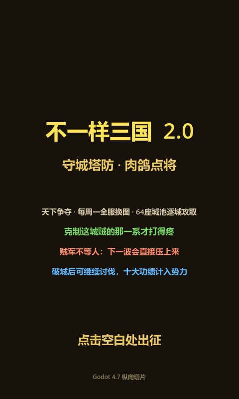

# Godot 4.7 纵向切片验证

## 已验证

- Godot 版本：`4.7.stable.official.5b4e0cb0f`
- 工程能够被 Godot 无窗口导入，未出现脚本解析或资源导入错误。
- GDScript 星级分段和伤害倍率与 Web 端测试样例一致。
- 主场景流程测试通过：标题 → 地图 → 主公 → 开局选将 → 自动战斗。
- 工程能够启动真实 Windows 窗口并在 480×800 客户区渲染标题页。

## 当前实现范围

当前纵向切片用于证明 Godot 工程结构、原生绘制、输入状态转换和自动更新循环可工作。它已经包含：

- 与 Web Demo 相同的 480×800 逻辑尺寸和深棕/金色视觉方向。
- 标题页和 64 城四区域信息。
- 第一座城入口和八主公列表。
- 三张开局武将卡、5×3 阵地和城墙。
- 可运行的自动战斗表现循环。

## 尚未迁移

当前切片不是完整 Demo 等效版。以下内容仍必须从 `demo-v7.18.8-baseline` 逐系统迁移并对照验收：

- 45 名武将及其普攻、绝技和成长数据。
- 18 条羁绊、遗物、永久战术卡和主公专属经济。
- 完整 64 城规则、四区解锁、周轮换、繁荣度和个人最佳。
- 全部敌军、贼首、波次突变、地形、障碍、投射物和伤害结算。
- 三选一卡池、15 星成长、结算、无尽和十大功绩。
- 英雄/主公养成、寻访、背包、成就、排行榜和账号云存档。
- Web 版视觉细节、音效、粒子、拖放和移动端触控对照。

后续每个系统只有在 Web 侧形成可测试规则和可序列化数据后，才进入对应 Godot 实现。

