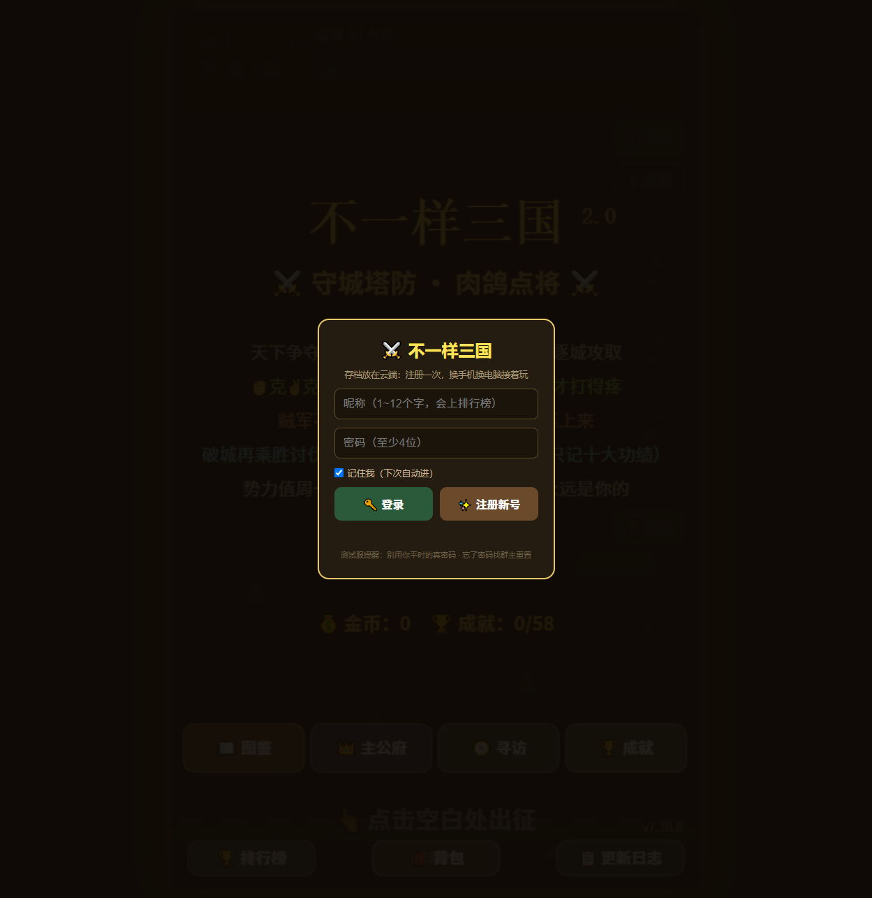

# Demo v7.18.8 源码基线

## 来源

- 抓取日期：2026-07-14（Asia/Shanghai）
- 线上主页面：<http://175.178.82.224:3000/>
- 线上更新日志：<http://175.178.82.224:3000/changelog.html>
- 页面声明版本：`GAME_VERSION = "7.18.8"`
- 存档键：`META_KEY = "sanguo_meta_v6"`

## 文件指纹

| 文件 | 字节数 | 行数 | SHA-256 |
| --- | ---: | ---: | --- |
| `web-demo/index.html` | 616652 | 11709 | `E72203EFAFFD6F142F80F5688EA9F446A50367B750F49DF7CDB62AE26D44BEE3` |
| `web-demo/changelog.html` | 168618 | 1828 | `EE60D7B2C808E685CA3F362725B2CF862B7E0FBFF2EE122C5A484B66350994CE` |

## 源码形态

- 主页面是单文件 Canvas 应用，HTML、CSS 和 JavaScript 全部内嵌。
- 未发现外部脚本或外部样式表依赖。
- 主文件包含约 278 个命名函数；这只是静态计数，不代表合理的模块边界。
- 页面运行时使用同源服务器接口：`/api/register`、`/api/login`、`/api/load`、`/api/save`、`/api/battle`、`/api/board` 和 `/api/version`。
- 浏览器端能够回收完整前端实现，但不能从发布页面恢复这些接口的服务器端源代码。

## 运行验证

- 线上主页面返回 HTTP 200。
- 使用真实 Chrome 会话加载后，账号登录弹窗和背景 Canvas 均正常渲染。
- 首屏未出现阻断性 JavaScript 异常。
- 当前控制台有一个 `favicon.ico` 404，以及密码输入框未包含在 `form` 中的浏览器提示。
- 验证尚未使用真实账号完成登录、云存档、排行榜写入或完整战斗流程。

首屏证据：

## 权威边界

本目录中的文件是 2026-07-14 从线上地址获取的发布快照，应作为重构前的原始行为基线。后续修改必须通过 Git 历史与 `demo-v7.18.8-baseline` 标签和这份快照对照，不应把旧版本说明或源码注释直接当成当前执行行为。
